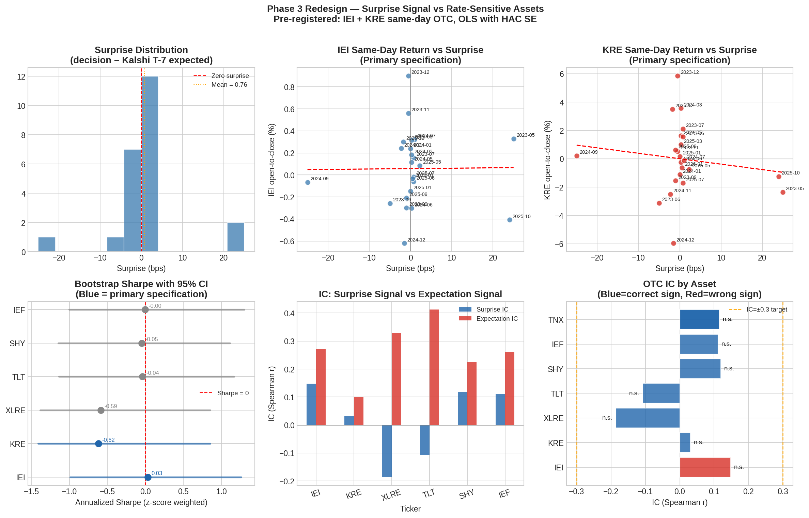

# kalshi-fomc-nlp

**Can a Computer Read the Fed? NLP, Prediction Markets, and FOMC Informational Efficiency**



## Abstract

We applied Loughran-McDonald dictionary signals, fine-tuned transformer classifiers, and Bernanke-Kuttner surprise methodology to Federal Reserve communications across 62 FOMC meetings and found that Kalshi rate-decision prediction markets are efficient by every test constructed: against text signals, domain-adapted ML models, and their own realized surprise residuals. The key finding: `corr(T-7, T-1) = 0.9993`, confirming that Kalshi markets reach their final probabilistic assessment a full week before each announcement and do not materially revise.

## Key Findings

| Phase | Test | Signal | Result |
|---|---|---|---|
| 1 | LM dictionary vs Kalshi MixMCP | LM composite (r=0.069) | alpha*=0.00 - Kalshi dominant |
| 2 | Fine-tuned FinBERT vs Kalshi | FinBERT (r=0.348) | alpha*=0.00 - Kalshi still dominant |
| 3 v1 | Kalshi expectation portfolio | T-7 implied expected bps | IR=0.57 - anticipated in prices |
| 3 v2 | Surprise signal (Bernanke-Kuttner) | decision - T-7 expected | Near-zero variance, corr=0.9993 |

## Repository Structure

```text
.
├── README.md                         # Project overview, methods, findings, and reproducibility notes
├── .gitignore                        # Excludes credentials, raw data, logs, virtualenvs, and build artifacts
├── data/                             # Data access instructions; raw data is stored externally
│   └── README.md                     # Google Drive and reconstruction notes
├── figures/                          # Final figure outputs used in notebooks and report
│   ├── fig1_signal_timeseries.png
│   ├── fig2_validation.png
│   ├── fig3_equity_backtest.png
│   ├── fig4_calibration.png
│   ├── fig5_alpha_sweep.png
│   ├── fig6_decision_distribution.png
│   ├── fig7_volume_tiers.png
│   ├── fig8_structural_decomposition.png
│   ├── fig10_transformer_comparison.png
│   ├── fig11_fractile_returns.png
│   ├── fig12_portfolio_summary.png
│   └── fig13_phase3_redesign.png
├── notebooks/                        # Colab-ready analysis notebooks
│   ├── 01_phase1_lm_signal.ipynb
│   ├── 02_phase1_kalshi_backtest.ipynb
│   ├── 03_phase2_transformers.ipynb
│   ├── 04_phase3_surprise_signal.ipynb
│   └── ft370_analysis_s1_s4.ipynb
├── pipelines/                        # Data collection, scoring, and model-assessment scripts
├── report/                           # Final report documents, if present
└── results/                          # Committed Phase 3 result tables and JSON summaries
    ├── meeting_data.csv
    ├── portfolio_results.csv
    ├── regression_results.csv
    └── summary.json
```

## Notebooks

| Notebook | Description | Open in Colab |
|---|---|---|
| `01_phase1_lm_signal.ipynb` | Builds Loughran-McDonald text signals from Federal Reserve communications and compares them with Kalshi market-implied probabilities. | [](https://colab.research.google.com/github/nix064/kalshi-fomc-nlp/blob/main/notebooks/01_phase1_lm_signal.ipynb) |
| `02_phase1_kalshi_backtest.ipynb` | Tests Kalshi market signal calibration, portfolio construction, and backtest diagnostics for Phase 1. | [](https://colab.research.google.com/github/nix064/kalshi-fomc-nlp/blob/main/notebooks/02_phase1_kalshi_backtest.ipynb) |
| `03_phase2_transformers.ipynb` | Fine-tunes and evaluates transformer classifiers, including domain-adapted FinBERT-style FOMC sentiment models. | [](https://colab.research.google.com/github/nix064/kalshi-fomc-nlp/blob/main/notebooks/03_phase2_transformers.ipynb) |
| `04_phase3_surprise_signal.ipynb` | Implements the Bernanke-Kuttner surprise design and tests whether Kalshi residual surprises predict asset returns. | [](https://colab.research.google.com/github/nix064/kalshi-fomc-nlp/blob/main/notebooks/04_phase3_surprise_signal.ipynb) |
| `ft370_analysis_s1_s4.ipynb` | Consolidated analysis notebook covering sections S1-S4 of the project workflow. | [](https://colab.research.google.com/github/nix064/kalshi-fomc-nlp/blob/main/notebooks/ft370_analysis_s1_s4.ipynb) |

## Data Access

Raw data files are not stored in this repository because they are too large for git and include source data governed by API/provider terms.

| Dataset | Description | Access |
|---|---|---|
| Kalshi KXFEDDECISION | 9,241 rows, rate-decision market prices Nov 2023-Feb 2026 | [Google Drive](https://drive.google.com/drive/folders/1QfwrOqGvLdVPa1l9H3pE6_VBvI8pyCF0?usp=sharing) |
| Kalshi KXFEDMENTION | 9,241 rows, mention market prices | [Google Drive](https://drive.google.com/drive/folders/1QfwrOqGvLdVPa1l9H3pE6_VBvI8pyCF0?usp=sharing) |
| Fed documents corpus | 254 documents, 2018-2026, LM-scored | [Google Drive](https://drive.google.com/drive/folders/1QfwrOqGvLdVPa1l9H3pE6_VBvI8pyCF0?usp=sharing) |
| Equity returns | TLT/IEF/XLF/SPY/IEI/KRE daily, 2018-2026 | Reconstructed via `yfinance` in notebooks |
| Shah et al. training data | 2,329 FOMC sentences (hawkish/dovish/neutral) | [github.com/gtfintechlab/fomc-hawkish-dovish](https://github.com/gtfintechlab/fomc-hawkish-dovish) |
| Phase 3 results | `regression_results.csv`, `portfolio_results.csv`, `summary.json` | [`results/`](results/) in this repo |

Google Drive (read-only): [https://drive.google.com/drive/folders/1QfwrOqGvLdVPa1l9H3pE6_VBvI8pyCF0?usp=sharing](https://drive.google.com/drive/folders/1QfwrOqGvLdVPa1l9H3pE6_VBvI8pyCF0?usp=sharing)

## Infrastructure

The project used AWS EC2 for data operations: a `t3.micro` always-on instance for live data collection and a `t3.xlarge` instance for batch jobs. Market and document data were stored in Snowflake under the `PREDMARKET` database, with `KALSHI` and `POLYMARKET` schemas. Transformer training and notebook experimentation used Google Colab with a T4 GPU.

## Built with AI

All 5 data pipelines, the Snowflake schema design, EC2 deployment, analysis notebooks, and project reports were developed in real-time collaboration with Claude (Anthropic). Every methodological decision was made by the author; Claude assisted with code execution, debugging, and documentation. Estimated 300+ prompts over the course of the semester.

## Key References

Bernanke, B. S., & Kuttner, K. N. (2005). What explains the stock market's reaction to Federal Reserve policy? *Journal of Finance*, 60(3), 1221-1257.

Diercks, K., Katz, J., & Wright, J. (2026). Kalshi and the rise of macro markets. NBER Working Paper.

Kim, J., et al. (2026). Forecasting future language mention markets. Working paper.

Shah, R., Paturi, S., & Chava, S. (2023). Trillion dollar words. Proceedings of ACL 2023.

Loughran, T., & McDonald, B. (2011). When is a liability not a liability? *Journal of Finance*, 66(1), 35-65.

## Author and Advisor

Nic Saliou · Bentley University · FT370 NLP in Finance · Advisor: Prof. Cong Zhang · May 2026
